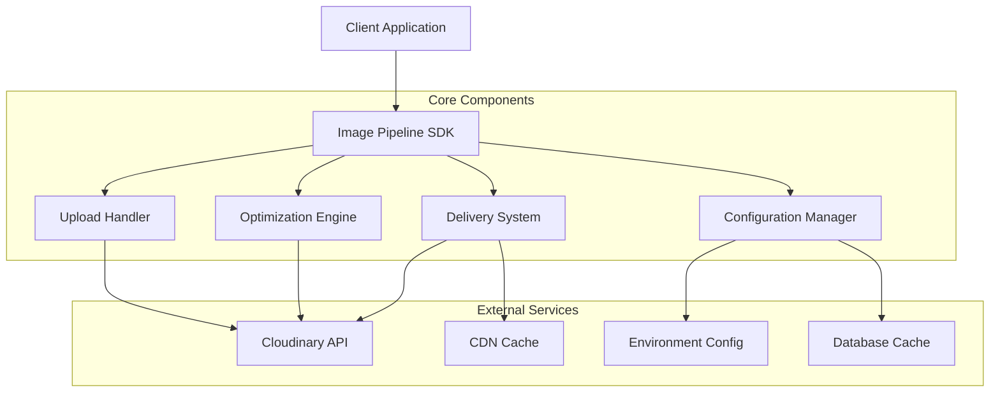

# Design Document: Image Optimization Pipeline

## Overview

The Image Optimization Pipeline is a reusable, configuration-driven TypeScript/JavaScript library that provides enterprise-level image optimization for ecommerce applications. The system integrates with Cloudinary to automatically compress, resize, and deliver images in modern formats while staying within free tier limits. The architecture is designed as a pluggable npm package that can be easily integrated into existing Next.js, React, and Node.js applications.

## Architecture

The system follows a modular, plugin-based architecture with clear separation of concerns:



### Component Responsibilities

- **Image Pipeline SDK**: Main entry point providing unified API for all operations
- **Configuration Manager**: Handles environment-specific settings and caching strategies
- **Upload Handler**: Manages secure uploads to Cloudinary with signed URLs
- **Optimization Engine**: Applies transformation presets and format optimization
- **Delivery System**: Generates optimized URLs and manages responsive image delivery

## Components and Interfaces

### 1. Configuration Manager

```typescript
interface ImagePipelineConfig {
  cloudinary: {
    cloudName: string;
    apiKey: string;
    apiSecret: string;
    uploadPreset: string;
  };
  optimization: {
    maxWidth: number;
    quality: 'auto:eco' | 'auto:good' | 'auto:best';
    formats: ('webp' | 'avif' | 'auto')[];
    maxFileSize: number; // in bytes
  };
  delivery: {
    enableLazyLoading: boolean;
    responsiveBreakpoints: number[];
    cacheUrls: boolean;
  };
  storage?: {
    database?: DatabaseAdapter;
    cacheTable?: string;
  };
}

interface DatabaseAdapter {
  saveOptimizedUrl(originalId: string, optimizedUrl: string): Promise<void>;
  getOptimizedUrl(originalId: string): Promise<string | null>;
}
```

### 2. Upload Handler

```typescript
interface UploadResult {
  publicId: string;
  secureUrl: string;
  originalSize: number;
  optimizedSize: number;
  format: string;
  width: number;
  height: number;
}

interface UploadHandler {
  generateSignature(params: UploadParams): Promise<SignatureData>;
  uploadImage(file: File | Buffer, options?: UploadOptions): Promise<UploadResult>;
  validateFile(file: File | Buffer): ValidationResult;
}

interface UploadParams {
  publicId?: string;
  folder?: string;
  transformation?: string;
  timestamp: number;
}

interface SignatureData {
  signature: string;
  timestamp: number;
  apiKey: string;
  cloudName: string;
}
```

### 3. Optimization Engine

```typescript
interface OptimizationEngine {
  createPreset(config: OptimizationConfig): string;
  getOptimizedUrl(publicId: string, variant?: ImageVariant): string;
  generateResponsiveUrls(publicId: string): ResponsiveImageSet;
}

interface ImageVariant {
  width: number;
  height?: number;
  crop?: 'fill' | 'fit' | 'limit' | 'scale';
  quality?: string;
  format?: string;
}

interface ResponsiveImageSet {
  srcset: string;
  sizes: string;
  fallback: string;
  variants: {
    width: number;
    url: string;
  }[];
}
```

### 4. Delivery System

```typescript
interface DeliverySystem {
  getImageUrl(publicId: string, variant?: ImageVariant): string;
  getResponsiveImageProps(publicId: string): ResponsiveImageProps;
  preloadCriticalImages(publicIds: string[]): void;
}

interface ResponsiveImageProps {
  src: string;
  srcSet: string;
  sizes: string;
  alt?: string;
  loading?: 'lazy' | 'eager';
  decoding?: 'async' | 'sync' | 'auto';
}
```

## Data Models

### Image Metadata Model

```typescript
interface ImageMetadata {
  id: string;
  publicId: string;
  originalFilename: string;
  originalSize: number;
  optimizedSize: number;
  compressionRatio: number;
  format: string;
  width: number;
  height: number;
  uploadedAt: Date;
  cloudinaryUrl: string;
  variants: ImageVariant[];
}
```

### Cache Entry Model

```typescript
interface CacheEntry {
  publicId: string;
  variant: string; // JSON stringified variant config
  optimizedUrl: string;
  createdAt: Date;
  expiresAt?: Date;
}
```

### Upload Preset Configuration

```typescript
interface UploadPresetConfig {
  name: string;
  unsigned: boolean;
  transformation: {
    width: number;
    crop: string;
    quality: string;
    format: string;
    flags: string[];
  };
  allowedFormats: string[];
  maxFileSize: number;
  folder: string;
  publicIdPrefix?: string;
}
```

## Correctness Properties

*A property is a characteristic or behavior that should hold true across all valid executions of a system-essentially, a formal statement about what the system should do. Properties serve as the bridge between human-readable specifications and machine-verifiable correctness guarantees.*

### Property 1: Secure Upload Behavior
*For any* image file, the upload process should use signed Cloudinary uploads, never store files locally, and always apply the configured upload preset
**Validates: Requirements 1.1, 1.2, 1.3**

### Property 2: File Size Validation
*For any* file upload attempt, files larger than 10MB should be rejected with appropriate error messaging
**Validates: Requirements 1.4, 5.3**

### Property 3: Unique Public ID Generation
*For any* set of uploaded images, all generated public_id values should be unique to prevent duplicates
**Validates: Requirements 1.5, 6.1**

### Property 4: Size Optimization Constraints
*For any* processed image, the output should have maximum width of 1200px, maintain aspect ratio, and result in file sizes between 50KB-200KB
**Validates: Requirements 2.1, 2.2, 2.8, 2.9**

### Property 5: Compression Settings
*For any* image optimization, lossy compression with quality target around 80% and automatic quality selection should be applied
**Validates: Requirements 2.3, 2.4**

### Property 6: Format Optimization
*For any* image delivery, WebP should be the default format, AVIF should be used when supported, with automatic fallback for unsupported browsers, and PNG should only be used when transparency is required
**Validates: Requirements 2.5, 2.6, 2.7, 8.5**

### Property 7: Configuration Consistency
*For any* project integration, the same standardized preset parameters (f_auto, q_auto:eco, w_1200, c_limit) should be applied consistently
**Validates: Requirements 3.3**

### Property 8: Environment Configuration
*For any* configuration change via environment variables, the system behavior should adapt accordingly without code changes
**Validates: Requirements 3.4, 7.1**

### Property 9: CDN URL Generation
*For any* image request, all generated URLs should point to Cloudinary CDN endpoints
**Validates: Requirements 4.1**

### Property 10: Responsive Image Attributes
*For any* responsive image generation, the output should include proper srcset attributes and lazy loading configuration
**Validates: Requirements 4.2, 4.3**

### Property 11: Responsive Variants Generation
*For any* image, the system should generate variants at 300px (thumbnails), 600px (product cards), and 1200px (product detail) widths
**Validates: Requirements 4.4, 4.5, 4.6**

### Property 12: URL Caching Behavior
*For any* optimized URL generation, the result should be cached in the database and reused for identical requests to minimize API calls
**Validates: Requirements 4.7, 6.2, 6.4**

### Property 13: Automatic Optimization
*For any* image upload, optimization should occur automatically without requiring manual intervention
**Validates: Requirements 5.2**

### Property 14: Transformation Efficiency
*For any* image processing, only necessary transformations should be applied to avoid unnecessary eager transformations
**Validates: Requirements 6.3**

### Property 15: Usage Metrics Tracking
*For any* pipeline operation, usage metrics should be recorded to monitor free tier consumption
**Validates: Requirements 6.5**

### Property 16: Helper Function URL Generation
*For any* call to helper functions, the generated optimized image URLs should be valid and properly formatted
**Validates: Requirements 7.6**

### Property 17: Compression Effectiveness
*For any* image processed from original camera resolution, the file size should be reduced by 95-99% while maintaining the same visual content
**Validates: Requirements 8.1**

<function_calls>
<invoke name="prework">
<parameter name="featureName">image-optimization-pipeline

## Error Handling

### Upload Errors
- **File Size Exceeded**: Return structured error with current size and limit
- **Invalid Format**: Reject unsupported file types with clear messaging  
- **Network Failures**: Implement retry logic with exponential backoff
- **Cloudinary API Errors**: Parse and translate API errors to user-friendly messages

### Optimization Errors
- **Transformation Failures**: Fallback to basic optimization if advanced transforms fail
- **Format Conversion Issues**: Gracefully degrade to supported formats
- **Quality Degradation**: Alert if compression results in unacceptable quality loss

### Configuration Errors
- **Missing Credentials**: Validate Cloudinary configuration at initialization
- **Invalid Presets**: Verify upload presets exist before use
- **Database Connection**: Handle database unavailability gracefully with in-memory fallback

### Delivery Errors
- **CDN Failures**: Implement fallback URL generation strategies
- **Cache Misses**: Regenerate URLs when cache entries are invalid
- **Browser Compatibility**: Detect and handle unsupported format scenarios

## Testing Strategy

### Dual Testing Approach
The system will use both unit testing and property-based testing for comprehensive coverage:

**Unit Tests**: Focus on specific examples, edge cases, and integration points
- Configuration validation with various environment setups
- Error handling scenarios with specific failure conditions
- Integration tests with Next.js, React, and Node.js environments
- Database adapter functionality with different storage backends

**Property-Based Tests**: Verify universal properties across all inputs
- Each correctness property will be implemented as a property-based test
- Minimum 100 iterations per property test to ensure comprehensive coverage
- Tests will use fast-check library for TypeScript/JavaScript property testing
- Each test tagged with format: **Feature: image-optimization-pipeline, Property {number}: {property_text}**

### Property Test Configuration
- **Library**: fast-check for TypeScript/JavaScript property-based testing
- **Iterations**: Minimum 100 per property test
- **Generators**: Smart input generation for images, configurations, and file sizes
- **Shrinking**: Automatic counterexample minimization for failed properties

### Test Coverage Areas
- **Upload Flow**: File validation, signature generation, Cloudinary integration
- **Optimization**: Transformation application, format selection, size constraints  
- **Delivery**: URL generation, caching behavior, responsive image creation
- **Configuration**: Environment variable handling, preset management
- **Integration**: Framework compatibility, database adapter functionality

### Performance Testing
- **Load Testing**: Verify system handles concurrent uploads efficiently
- **Memory Usage**: Ensure no memory leaks during batch processing
- **Cache Performance**: Validate caching reduces API calls as expected
- **CDN Integration**: Test delivery speed and reliability